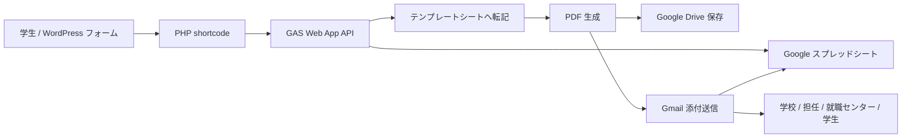

# WordPress Forms / Google Apps Script 連携

このリポジトリは、UCS 就職センターサイトの学生向けフォームと、Google Apps Script 側の帳票生成・メール送信処理を管理するためのものです。

対象サイト:

- https://www.ucsjp.jp/cc/

## 概要

学生は WordPress 上のフォームから報告内容を入力します。フォーム本体は PHP の shortcode として実装されており、送信時に入力データを Google Apps Script Web App API へ送ります。

Google Apps Script 側では、受け取った payload を Google スプレッドシートへ保存し、テンプレートシートへ転記して PDF を作成します。作成された PDF は Google Drive の指定フォルダへ保存され、学校、担任、就職センター、学生本人へメール添付で送信されます。

## ディレクトリ構成

```text
.
├── wordpress/
│   ├── form_exam_report.php
│   ├── form_company_description.php
│   └── form_certificate.php
└── gas/
    ├── generateExamReportPDF.js
    ├── generateCompanyDescriptionPDF.js
    ├── handleCertificateRequest.js
    ├── appsscript.json
    └── README.md
```

## WordPress 側

`wordpress/` には WordPress に配置する PHP フォームがあります。

### `form_exam_report.php`

就職試験報告書フォームです。

- shortcode: `[exam_report_form]`
- 学生情報、受験企業、応募方法、試験内容、感想などを入力します。
- 複数の試験種別を動的に追加できます。
- 送信時に WordPress から GAS Web App へ `payload` を POST します。

### `form_company_description.php`

企業訪問・企業説明会報告書フォームです。

- shortcode: `[company_description_form]`
- 学生情報、訪問先、会場、日時、面談者、受験意思、感想などを入力します。
- `レポート種別` に `企業訪問・企業説明会報告書` を付与して GAS へ送信します。

### `form_certificate.php`

証明書申請フォームです。

- shortcode: `[certificate-form]`
- フロントエンド入力・確認 UI から GAS Web App へ `payload` を POST します。
- GAS 側で `DB_証明書申請` シートへ保存し、学校、担任、就職センターへ証明書申請メールを送信します。

## GAS 側

`gas/` には Google Apps Script プロジェクトへ deploy するコードがあります。

### `generateExamReportPDF.js`

就職試験報告書の処理を担当します。

- `doGet(e)` / `doPost(e)` で Web App request を受け取ります。
- `routeWebhook_(e)` で payload を判定します。
- 通常の就職試験報告書 payload は `handleWebhook_(e)` へ流します。
- フォーム回答を `フォームの回答` シートへ追記します。
- `テンプレート` シートを一時コピーし、入力内容を転記します。
- PDF を作成して Drive フォルダへ保存します。
- メール送信結果を `メール送信レポート` 列へ JSON で保存します。

### `generateCompanyDescriptionPDF.js`

企業訪問・企業説明会報告書の処理を担当します。

- `handleCompanyDescriptionWebhook_(e)` が企業訪問・企業説明会 payload を処理します。
- フォーム回答を `DB_訪問説明会` シートへ追記します。
- `訪問説明会報告書` シートを一時コピーし、入力内容を転記します。
- PDF を作成して Drive フォルダへ保存します。
- メール送信結果を `メール送信レポート` 列へ JSON で保存します。

### `handleCertificateRequest.js`

証明書申請フォームの処理を担当します。

- `handleCertificateWebhook_(e)` が証明書申請 payload を処理します。
- フォーム回答を `DB_証明書申請` シートへ追記します。
- 学校、担任、就職センターへ申請内容メールを送信します。
- メール送信結果を `メール送信レポート` 列へ JSON で保存します。

## データフロー



## メール送信先

帳票 PDF は以下へ送信されます。

- 学校: `学校メールアドレス` シートの学校名から取得
- 担任: `担任` シートの担任名から取得
- 就職センター: Script Property で test / production を切り替え
- 学生: フォーム入力の `メールアドレス`

就職センター宛メールは、誤送信防止のためデフォルトでテストアドレスへ送信されます。

- test: `eduard@hsc.ac.jp`
- production: `syushoku@ucs-hiroshima.ac.jp`

Apps Script の Script Properties で `USE_PRODUCTION_CAREER_CENTER_MAIL` を `true` に設定すると production 宛になります。未設定、または `true` 以外の値の場合は test 宛です。

## Google スプレッドシート

GAS は以下のスプレッドシートを使用します。

- Spreadsheet ID: `1AzvCp6NUZJ_xch5911sL7euOqy-Xi4wE4x18Bks0vqc`

主なシート:

- `フォームの回答`: 就職試験報告書の回答保存先
- `テンプレート`: 就職試験報告書 PDF のテンプレート
- `DB_訪問説明会`: 企業訪問・企業説明会報告書の回答保存先
- `訪問説明会報告書`: 企業訪問・企業説明会 PDF のテンプレート
- `DB_証明書申請`: 証明書申請フォームの回答保存先
- `担任`: 担任名とメールアドレスのマスタ
- `学校メールアドレス`: 学校名とメールアドレスのマスタ

## デプロイ

`gas/` ディレクトリは GitHub Actions から Apps Script へ deploy されます。詳細は `gas/README.md` を参照してください。

必要な repository secret:

- `CLASPRC_JSON`: ローカル `~/.clasprc.json` の内容

対象 Apps Script project:

- `1CdriYl4LWNudAkRhQiPnLuROWdtJiBG6fUwBpojWx4bePfUQykC_VXWx`

## 運用メモ

- WordPress 側の GAS endpoint は `script.google.com/macros/.../exec` の URL を PHP 内に保持しています。
- GAS Web App の redirect が返る場合があるため、WordPress 側では 3xx の `location` を追跡して再取得しています。
- 同名 PDF が既に Drive フォルダにある場合、既存ファイルは trash へ移動してから新しい PDF を保存します。
- メール送信は `GmailApp.sendEmail` を使用します。
- エラーや送信結果はフォーム画面とスプレッドシートの `メール送信レポート` で確認します。
